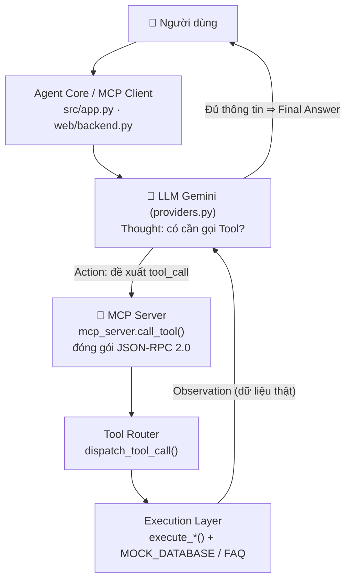
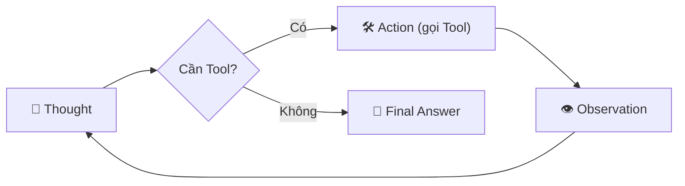

# 🎤 TÀI LIỆU PHẢN BIỆN — BÀI LAB 3: CHATBOT VS REACT AGENT (MCP)

> **Học viên:** Đỗ Khắc Gia Khoa · **MSSV:** 2A202602733 · **Chủ đề:** Trợ lý Học vụ VinUni (Giáo dục)
> Dùng tài liệu này để ôn trước khi phản biện. Mỗi mục gồm câu hỏi thầy/cô có thể hỏi + gợi ý trả lời bám sát code.

---

# 🎯 KỊCH BẢN TRÌNH BÀY — THEO ĐÚNG 5 Ý THẦY YÊU CẦU

> Thầy (Dudumi) yêu cầu demo theo 5 ý dưới đây, **nên có 1 UI để demo** (mình đã có Web UI React). Trình bày lần lượt:

## ✅ Ý 1 — Chọn đề tài gì? Tại sao chọn đề tài đó?
- **Đề tài:** *Trợ lý Học vụ & Tra cứu Lịch thi VinUni* (Gợi ý 1.1 — lĩnh vực Giáo dục).
- **Lý do chọn:**
  1. Là **bài toán thật**, gần với sinh viên: tra cứu hồ sơ/điểm/lịch thi, đặt lịch tư vấn, đăng ký môn.
  2. Cần **cả tra cứu thông tin lẫn hành động** (đặt lịch/đăng ký) → đúng yêu cầu tối thiểu 2 loại tool.
  3. Có **nhiều bước suy luận nối tiếp** (vd tra cứu cố vấn rồi mới đặt lịch) → hợp với ReAct Agent.
  4. Dễ mở rộng thêm tool (thời gian thực, sổ tay chương trình) để agent "làm được nhiều hơn".

## ✅ Ý 2 — Tại sao ReAct Agent Pattern phù hợp? (4 tiêu chí Agentic Fit — thang điểm /5)

| Tiêu chí | Điểm | Giải thích ngắn |
| :--- | :---: | :--- |
| **Multi-step Reasoning** | 4/5 | Có chuỗi nhiều bước: tra cứu cố vấn → đặt lịch với đúng cố vấn đó. |
| **Tool Interaction** | 5/5 | Bắt buộc gọi Tool/MCP để có GPA, lịch thi, booking — không thể "đoán". |
| **Dynamic Decision** | 4/5 | Bước sau phụ thuộc kết quả bước trước (NOT_FOUND → đổi hướng trả lời). |
| **Long Horizon Goal** | 3/5 | Giữ mục tiêu trong 1 phiên hội thoại (tra cứu → hành động). |
| **TỔNG** | **16/20** | >12 ⇒ **rất phù hợp** triển khai ReAct Agent. |

- **Chốt:** Nếu chỉ là hỏi–đáp FAQ cố định thì **không cần** Agent (dùng chatbot rẻ hơn). Bài này cần **tra cứu dữ liệu thật + hành động + suy luận đa bước** ⇒ đúng "đất diễn" của ReAct Agent.

## ✅ Ý 3 — Kiến trúc Agent (biểu đồ)

**Biểu đồ kiến trúc tổng thể (MCP Client – Server):**


**Vòng lặp ReAct (Thought → Action → Observation, lặp đa bước):**


- **Điểm nhấn khi nói:** LLM chỉ **quyết định**, MCP Server **thực thi** — tách bạch rõ ràng; giao tiếp chuẩn **JSON-RPC 2.0**; vòng lặp lặp lại tới khi đủ dữ liệu (tối đa `MAX_ITERATIONS=5`).

## ✅ Ý 4 — Sử dụng những tool gì? Tác dụng từng tool

| # | Tool | Loại | Tác dụng |
| :-: | :--- | :--- | :--- |
| 1 | `academic_query` | Tra cứu | Tra hồ sơ học vụ theo mã SV (tên, lớp, GPA, cố vấn...). |
| 2 | `schedule_appointment` | Hành động | Đặt lịch hẹn tư vấn với cố vấn (SV, thời gian, cố vấn). |
| 3 | `get_current_datetime` | Tra cứu | Lấy **ngày giờ thực tế** (giờ VN) — trả lời "hôm nay ngày mấy". |
| 4 | `get_exam_schedule` | Tra cứu | Tra **lịch thi** (môn, ngày, phòng) theo mã SV. |
| 5 | `register_course` | Hành động | **Đăng ký môn học** theo mã môn. |
| 6 | `search_guidebook` | Tra cứu | Tra **Sổ tay chương trình** (học phí, trợ cấp, ĐGNL, thực tập...) từ kho tri thức thật. |

- 2 tool đầu là yêu cầu core; 4 tool sau là phần mở rộng để agent "làm được nhiều hơn".

## ✅ Ý 5 — Demo 1–2 câu hỏi trực tiếp, show trace log từng bước

**Câu demo 1 (đa bước — ấn tượng nhất):**
> "Tra cứu cố vấn học tập của SV2026001, sau đó đặt lịch hẹn với đúng cố vấn đó vào 09:30 ngày 20/09/2026."
- Chỉ vào **cột phải (Luồng suy luận)**: `academic_query` → Observation (cố vấn = PGS.TS Nguyễn Văn A) → `schedule_appointment` → Observation (booking) → Final Answer. Header hiện **"đã gọi: academic_query → schedule_appointment"**.

**Câu demo 2 (chọn 1):**
> "Hôm nay là ngày bao nhiêu?" → tool thời gian thực · **hoặc** "Tra cứu SV9999999" → **NOT_FOUND**, không bịa (chống ảo giác).

- Nói thêm: mọi bước được ghi ra **`docs/trace_waterfall.json`** (Waterfall Trace Log) — bằng chứng chuỗi Thought → Action → Observation → Final.

---

## PHẦN A — KHÁI NIỆM NỀN TẢNG (phải nắm vững)

### 1. Chatbot khác ReAct Agent ở điểm nào?
- **Chatbot (Cấp 2):** chỉ sinh văn bản từ kiến thức đã học của LLM. Không truy cập dữ liệu thời gian thực, dễ **ảo giác (hallucination)**. Trong code là `run_baseline_chatbot()` — chỉ gọi `provider.generate()`.
- **ReAct Agent (Cấp 3):** biết **tự suy luận và gọi công cụ (Tool)** để lấy dữ liệu thật, rồi mới trả lời. Vòng lặp **Thought → Action → Observation**. Trong code là `run_react_agent()` / `provider.run_agent()`.
- 4 cấp độ: (1) Rule-based `if/else` → (2) LLM Chatbot → (3) ReAct Agent + Tool → (4) Autonomous Agent (tự lập kế hoạch, có memory).

### 2. ReAct là gì? Giải thích Thought → Action → Observation.
- **Thought:** LLM suy luận xem cần dữ liệu gì để trả lời.
- **Action:** LLM quyết định **gọi Tool nào, với tham số gì** (Native Tool Calling).
- **Observation:** kết quả Tool trả về (dữ liệu thật) được nạp lại cho LLM.
- Lặp cho tới khi đủ thông tin → **Final Answer**. ReAct = **Rea**soning + **Act**ing.

### 3. MCP (Model Context Protocol) là gì? Tại sao dùng?
- Là **chuẩn mở kết nối Agent với công cụ/dữ liệu bên ngoài** theo mô hình **Client–Server**.
- Ý tưởng cốt lõi: **Tool KHÔNG nằm trong LLM** mà được một **MCP Server** phục vụ độc lập; Agent đóng vai **MCP Client** gửi yêu cầu thực thi Tool.
- Lợi ích: tách bạch (LLM chỉ "quyết định", Server "thực thi"), dễ thay/thêm Tool, chuẩn hóa giao tiếp, tái sử dụng cho nhiều Agent.
- Trong bài: `src/mcp_server.py` = MCP Server; `src/app.py` (và `web/backend.py`) = MCP Client.

### 4. JSON-RPC 2.0 là gì? Ở đâu trong bài?
- Là giao thức gọi hàm từ xa dùng JSON, các trường chuẩn như `jsonrpc: "2.0"`.
- Trong hàm `call_tool()` (TODO 2.1), phản hồi được đóng gói:
  ```json
  { "jsonrpc": "2.0", "server": "vinuni-academic-mcp-server", "tool": "academic_query", "result": { ... } }
  ```

### 5. Tool Schema / Function Calling / JSON Schema là gì?
- LLM hiểu công cụ qua **JSON Schema**: `name` (tên), `description` (mục đích), `parameters` (kiểu dữ liệu tham số + `required`).
- **Native Tool Calling:** ta khai báo schema cho LLM; LLM tự đọc câu hỏi và **tự sinh lời gọi tool** đúng tham số (không cần ta parse thủ công).
- `description` cực quan trọng: đó là cách LLM biết **khi nào** nên dùng tool nào.

### 6. Anti-Hallucination (chống bịa) thể hiện ở đâu?
- Agent **chỉ trả lời dựa trên Observation thật** từ Tool. Nếu Tool trả `NOT_FOUND` (vd `SV9999999`), Agent nói trung thực "không tìm thấy", **không bịa** — đã kiểm chứng ở TC05.

---

## PHẦN B — CÂU HỎI VỀ CODE CORE (thầy hay soi 2 TODO)

### 7. Giải thích TODO 1.2 — Tool Schema `schedule_appointment`?
- File `src/tools.py`. Khai báo `properties` gồm 3 tham số `student_id`, `datetime_str`, `advisor_name` (đều `type: string`, có `description` rõ ràng) và `required` liệt kê cả 3.
- Nhờ schema này, khi người dùng nói "đặt lịch cho SV2026001 lúc 14:00 15/09 với thầy A", Gemini **tự trích** đúng 3 tham số và sinh tool_call.

### 8. Giải thích TODO 2.1 — hàm `call_tool()`?
- File `src/mcp_server.py`. 3 bước:
  1. Gọi `dispatch_tool_call(tool_name, arguments)` → nhận **chuỗi JSON** kết quả từ Tool Router.
  2. `json.loads()` chuỗi đó → **Python dict** (chính là Observation).
  3. Đóng gói theo chuẩn **JSON-RPC 2.0**: `{jsonrpc, server, tool, result}` và `return`.
- Có `try/except` cho trường hợp JSON lỗi (trả `PARSE_ERROR`) → phòng thủ.

### 9. Mô tả luồng đi của 1 câu hỏi (kiến trúc)?
```
Người dùng → Agent Core (MCP Client)
           → provider.generate_with_tools/run_agent  (LLM quyết định gọi tool)
           → mcp_server.call_tool()                  (MCP Server, JSON-RPC 2.0)
           → dispatch_tool_call()                    (Tool Router trong tools.py)
           → execute_xxx()                           (Execution Layer, truy vấn MOCK_DATABASE)
           → Observation → LLM tổng hợp → Final Answer
```

### 10. Tại sao tách Tool ra khỏi LLM (không để LLM "tự làm")?
- LLM không có dữ liệu thật/thời gian thực và hay bịa. Tool cho **dữ liệu chính xác, có kiểm soát**.
- Tách theo MCP giúp: bảo trì dễ, thêm tool không sửa LLM, một Server phục vụ nhiều Agent, an toàn (LLM không trực tiếp truy cập DB).

### 11. `MOCK_DATABASE` là gì — sao không dùng DB thật?
- Là dữ liệu mô phỏng trong `tools.py` để chạy offline, không tốn tiền/không cần hạ tầng. Trong thực tế chỉ cần thay `execute_academic_query` bằng truy vấn SQL/API thật là xong — **phần còn lại của kiến trúc giữ nguyên** (đó là ưu điểm của việc tách lớp).

---

## PHẦN C — CÂU HỎI VỀ PHẦN NÂNG CAO (điểm cộng, cần tự tin)

### 12. "ReAct đa bước thật sự" nghĩa là gì? Khác gì bản core?
- **Bản core (`src/app.py`):** theo thiết kế starter, gọi **1 tool rồi trả lời** (dừng sau tool_call đầu). Đủ minh họa vòng lặp ReAct cơ bản.
- **Bản nâng cao (`web/backend.py` + `provider.run_agent`):** **lặp nhiều bước** — sau mỗi Observation lại đưa về cho LLM, LLM có thể **gọi tiếp tool khác** hoặc chốt câu trả lời.
- **Ví dụ đã chạy:** "Tra cứu cố vấn của SV2026001 rồi đặt lịch với đúng cố vấn đó" → Agent gọi `academic_query` (biết cố vấn = PGS.TS Nguyễn Văn A) → gọi tiếp `schedule_appointment` với đúng tên cố vấn đó. **2 tool nối tiếp trong 1 câu hỏi.**

### 13. `MAX_ITERATIONS` để làm gì?
- Giới hạn số vòng lặp (=5) để **tránh lặp vô hạn** nếu LLM cứ gọi tool mãi không chốt. Chạm giới hạn thì tổng hợp câu trả lời từ Observation cuối (fallback).

### 14. Lỗi `thought_signature` là gì? Tớ đã sửa thế nào? (câu hỏi hay & ghi điểm)
- Gemini 3.x là **thinking model**: khi trả về function_call kèm một "chữ ký suy nghĩ" (`thought_signature`). Khi gửi lại lịch sử function_call cho bước sau mà **thiếu chữ ký** → API báo lỗi `400 INVALID_ARGUMENT`.
- **Cách sai (ban đầu):** tự dựng lại đối tượng function_call từ dict → mất chữ ký.
- **Cách đúng (đã áp dụng):** trong `GeminiProvider.run_agent`, **giữ nguyên object `response.candidates[0].content` gốc** (đã có sẵn chữ ký) rồi append vào lịch sử, sau đó thêm `function_response`. Nhờ vậy multi-step chạy đúng.

### 15. "Trí nhớ hội thoại" triển khai ra sao?
- Frontend (React) lưu mảng `history` các lượt {user, assistant} và **gửi kèm mỗi request** `/api/chat`.
- Backend nạp `history` vào đầu chuỗi hội thoại (`turns`/`contents`) trước câu hỏi mới → LLM hiểu ngữ cảnh câu hỏi nối tiếp (vd "còn lịch thi thì sao?").
- Giới hạn 12 lượt gần nhất để không phình context.

### 16. `search_guidebook` có phải RAG thật không? (nên trả lời trung thực)
- Đây là **RAG-lite**: tra cứu theo **từ khóa** trên kho tri thức (`GUIDEBOOK_KB`) trích từ FAQ thật của chương trình AI in Action, chọn 2 mục điểm cao nhất.
- **Khác RAG thật:** RAG thật dùng **embedding + vector search** (tìm theo ngữ nghĩa). Hướng nâng cấp: thay keyword match bằng embedding (vd sentence-transformers) + vector DB.

### 17. Multi-Provider Adapter là gì?
- `src/providers.py` có `GeminiProvider`, `OpenAIProvider`, `MockOfflineProvider` cùng chung interface (`generate`, `generate_with_tools`, `next_action`, `run_agent`).
- `get_llm_provider()` chọn provider theo biến `LLM_PROVIDER` trong `.env`. Nếu thiếu key hợp lệ → **tự fallback về Mock** để vẫn chạy được.
- Lợi ích: đổi LLM (Gemini/OpenAI) **không sửa logic Agent**.

### 18. Vì sao dùng model `gemini-flash-latest`?
- `gemini-2.5-flash` / `gemini-2.0-flash` đã bị Google gỡ với key này; `gemini-3.6-flash` chỉ cho **20 request/ngày** (free tier) — hết nhanh khi test.
- `gemini-flash-latest` (alias bản flash mới nhất) chạy ổn định, hỗ trợ Native Tool Calling, quota rộng hơn.

---

## PHẦN D — CÂU HỎI "BẪY" / TÌNH HUỐNG (chuẩn bị để không bị bí)

### 19. Nếu LLM gọi **sai tool** hoặc **tool không tồn tại** thì sao?
- `dispatch_tool_call` kiểm tra tool có trong `TOOL_ROUTER` không; nếu không → trả `UNKNOWN_TOOL`. Nếu tham số sai → `try/except` trả `EXECUTION_ERROR`. Agent nhận lỗi này như một Observation và phản hồi phù hợp, **không crash**.

### 20. Nếu Tool trả về lỗi/không có dữ liệu?
- Có các trạng thái `NOT_FOUND`, `INVALID_COURSE`... Agent đọc `status` và trả lời trung thực (đã thấy ở TC05). Đây chính là chống ảo giác.

### 21. Đây có phải MCP "thật" 100% không? (nên trung thực)
- Bài **mô phỏng kiến trúc MCP** (Client–Server tách biệt, đóng gói phản hồi JSON-RPC 2.0) để hiểu bản chất. **Chưa** dùng transport MCP thật (stdio/SSE) hay SDK MCP chính thức. Hướng nâng cấp: chạy MCP Server như tiến trình riêng giao tiếp qua stdio theo chuẩn `modelcontextprotocol`.

### 22. Agentic Fit — vì sao bài toán này hợp làm Agent? (bảo vệ bảng điểm 16/20)
- **Tool Interaction (5):** bắt buộc gọi Tool để có GPA/lịch/booking.
- **Multi-step (4):** có chuỗi tra cứu → hành động.
- **Dynamic Decision (4):** bước sau phụ thuộc kết quả bước trước (NOT_FOUND thì đổi hướng).
- **Long Horizon (3):** mục tiêu trong 1 phiên. Tổng 16/20 > 12 → phù hợp Agent.
- Ngược lại: nếu chỉ hỏi–đáp FAQ cố định thì **không cần Agent** (dùng chatbot rẻ hơn).

### 23. Bảo mật API key thế nào?
- Key để trong `.env`, đã **`.gitignore`** nên **không đẩy lên GitHub**. Khi deploy Render đặt key trong **Environment Variables (secret)**. Không hardcode trong code.

### 24. Chatbot baseline vs ReAct Agent trong code khác nhau ở đâu?
- Baseline: `provider.generate()` — không truyền `tools`. Agent: `provider.generate_with_tools()` / `run_agent()` — truyền danh sách tool schema để LLM có thể gọi.

### 25. `temperature=0.2` để làm gì?
- Giảm độ ngẫu nhiên → Agent **ổn định, bám tham số**, ít "sáng tạo lung tung" khi trích tham số tool. Phù hợp tác vụ cần chính xác.

---

## PHẦN E — KỊCH BẢN DEMO (chạy `python web/backend.py` → mở localhost:8000)

| # | Gõ câu hỏi | Điều cần chỉ cho thầy thấy |
| :-: | :--- | :--- |
| 1 | "Hôm nay là ngày bao nhiêu?" | Tool **thời gian thực** `get_current_datetime` — không bịa ngày |
| 2 | "Tra cứu thông tin học vụ SV2026001" | 1 tool `academic_query` → Observation JSON → Final |
| 3 | "Tra cứu cố vấn của SV2026001 rồi đặt lịch với đúng cố vấn đó vào 09:30 ngày 20/09/2026" | **ReAct đa bước**: 2 tool nối tiếp (cột phải hiện `academic_query → schedule_appointment`) |
| 4 | "Chương trình AI in Action hỗ trợ học phí và trợ cấp sinh hoạt ra sao?" | `search_guidebook` trả dữ liệu thật (miễn 100% học phí, 8 triệu/tháng) |
| 5 | "Tra cứu SV9999999" | **Anti-hallucination**: NOT_FOUND, không bịa |

> Chỉ vào **cột phải (Luồng suy luận)** để minh họa Thought → Action → Observation → Final và badge **LIVE** (đang dùng LLM thật).

---

## PHẦN F — ĐIỂM YẾU & HƯỚNG CẢI TIẾN (chủ động nêu để ghi điểm)

- **MCP mô phỏng**, chưa dùng transport MCP thật (stdio/SSE) → nâng cấp dùng SDK MCP chính thức.
- **Dữ liệu Mock**, chưa nối DB thật → thay Execution Layer bằng SQL/API.
- **search_guidebook keyword**, chưa phải semantic search → nâng cấp embedding + vector DB (RAG thật).
- **Trí nhớ** chỉ trong phiên (gửi từ frontend), chưa lưu bền → thêm session store / DB.
- **Chưa xử lý đồng thời nhiều người dùng** (state theo request) → thêm quản lý session.
- **Quota free tier giới hạn** → cân nhắc caching hoặc nâng cấp gói.

---

## PHẦN G — CÂU "CHỐT" NÊN THUỘC LÒNG (1–2 câu tóm tắt dự án)
> "Em xây một **ReAct Agent Trợ lý Học vụ** theo kiến trúc **MCP Client–Server**: LLM (Gemini) tự suy luận và gọi **6 công cụ** qua **MCP Server (JSON-RPC 2.0)**, thực thi **vòng lặp Thought–Action–Observation đa bước**, có **trí nhớ hội thoại** và chống ảo giác. Em bổ sung giao diện **React 2 cột** trực quan hóa luồng suy luận và deploy được lên Render."
